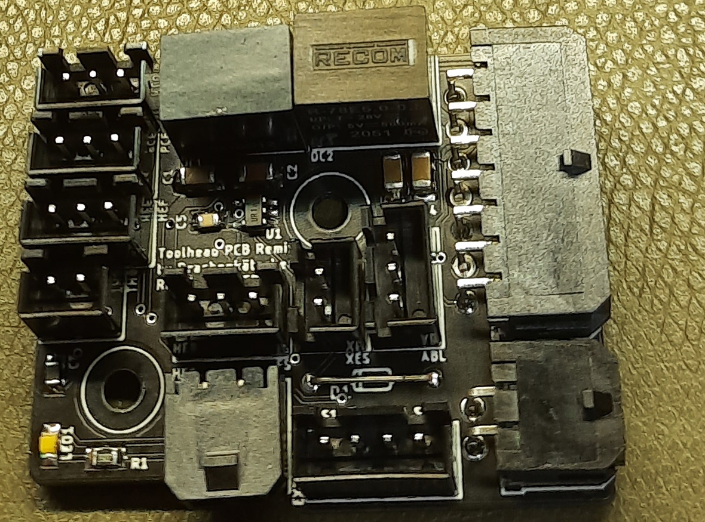

# Afterburner Toolhead PCB Remix

This is a drop-in remix of [hartk's Afterburner Toolhead PCB](https://github.com/hartk1213/Voron-Hardware/tree/master/Afterburner_Toolhead_PCB) v3.1 with the following changes:

- On-board 12V regulator to allow the operation of 12V fans, selectable for each fan using solder jumpers. Maximum 1A for the 12V rail.
- Pin Compatible with the Afterburner Toolhead PCB
- Decreased height to avoid interference with the Voron 1.8 gantry
- Increased clearance for the mounting screws to avoid damaging the traces

Rev A and Rev B have no support for the BAT85 Diode!

# Usage

This PCB replaces a hartk Afterburner Toolhead PCB. Replace your 24V fans with 12V fans as needed, and use
the solder jumpers to configure the voltage. Simply remove the old PCB and insert this one.

For assembly: Always start with the lowest height components and work your way up.

Note this PCB is `experimental` because it has yet to be determined if the DC/DC converters survive the
constant toolhead movements. Although the VR10S12 did survive for 100 printing hours now, it's unlikely that they fail, but we never know until we try.s

# BOM

| Designator           | Footprint       | Value            | Remarks
|----------------------|-----------------|------------------|--------------
| C1                   | 1206            | 10µF 35V         | ceramic caps are okay, too
| CT                   | 0805            | CMFB103F3950FANT | 10kΩ ±1% 3950K NTC Thermistor
| D1 (for VR10S12 )    | SMB             | 22µF 16V         | use a 1206 capacitor, 10µF ceramic is often okay, too
| D1 (for R-78C12-1.0) | SMB             | 1SMB5928BT3G     | as specified by the R-78C12-1.0 datasheet
| DC1                  | SIP 3           | VR10S12          | The original design used a Recom R-78C12-1.0, but a XP Power VR10S12 is cheaper
| LED1                 | 0805            | LED 0805         | Use any 0805 chip LED, indicates heater activity
| R1                   | 0805            | see remarks      | Calculate this appropriately for LED1 and 24V!
| HE0, HEF, PCF, XES   | JST-XH-02       | 2-pin JST XH     |
| ABL                  | JST-XH-03       | 3-pin JST XH     |
| E-STEP               | JST-XH-04       | 4-pin JST XH     |
| HE0                  | MOLEX 436500200 | MOLEX 436500200  |
| -                    | MOLEX 430451400 | MOLEX 430451400  |		

# Alternative Voltage Regulators

You can use one of these DC/DC voltage regulators if you are having trouble finding the `VR10S12`. Please refer
to the datasheet for any input/output decoupling.

__Please do not use any linear voltage regulators, because these require a heatsink and the acceleration forces will most likely shear off the voltage regulator over time.__

## 1A DC/DC Converters

- Traco Power `TSR 1-24120`
- Recom `R-78C12-1.0`

## 500mA DC/DC Converters

Use these only if you are sure that your fans will not exceed the current capability! The peak current when
the fans are starting up can be higher than specified!

- Aimtec `AMSR-7812-NZ`
- Traco Power `TSR 0.5-24120`
- XP Power `SR05S12`
 
# Design Notes

- The trace widths are calculated to allow operation within a 70°C chamber and a maximum temperature
  rise of 10°C.
- The pin assignments of the 14 pin MicroFit3 connector is unchanged
- The original version used a Recom R-78C12-1.0, but has been changed to a VR10S12 which lowers the cost significantly
- I've been using the Rev.A with a VR10S12 for about 100 hours of printing in conjunction with a single 12V fan, no issues observed so far