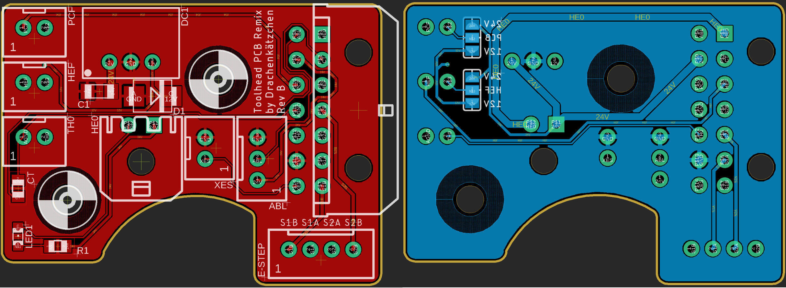

# Afterburner Toolhead PCB Remix

This is a highly experimental drop-in remix of [hartk's Afterburner Toolhead PCB](https://github.com/hartk1213/Voron-Hardware/tree/master/Afterburner_Toolhead_PCB) v3.1 with the following changes:

- On-board 12V regulator to allow the operation of 12V fans, selectable per fan using solder jumpers
- Decreased height to avoid interference with the Voron 1.8 gantry, thus making it compatible with any stock extruders (Afterburner + Galileo) without the need to adjust the screw holes
- Increased clearance for the mounting screws to avoid damaging the traces

# BOM

| Designator           | Footprint       | Value            | Remarks
|----------------------|-----------------|------------------|--------------
| C1                   | 1206            | 10µF 35V         | ceramic caps are okay, too
| CT                   | 0805            | CMFB103F3950FANT | 10kΩ ±1% 3950K NTC Thermistor
| D1 (for VR10S12 )    | SMB             | 22µF 16V         | use a 1206 capacitor, 10µF ceramic is often okay, too
| D1 (for R-78C12-1.0) | SMB             | 1SMB5928BT3G     | as specified by the R-78C12-1.0 datasheet
| DC1                  | SIP 3           | VR10S12          | The original design used a Recom R-78C12-1.0, but a VR10S12 is cheaper
| LED1                 | 0805            | LED 0805         | Use any 0805 chip LED
| R1                   | 0805            | see remarks      | LED to indicate HE0 activity. Calculate this appropriately for 24V!
| HE0, HEF, PCF, XES   | JST-XH-02       | 2-pin JST XH     |
| ABL                  | JST-XH-03       | 3-pin JST XH     |
| E-STEP               | JST-XH-04       | 4-pin JST XH     |
| HE0                  | MOLEX 436500200 | MOLEX 436500200  |
| -                    | MOLEX 430451400 | MOLEX 430451400  |		

# Design Notes

- The trace widths are calculated to allow operation within a 70°C chamber and a maximum temperature
  rise of 10°C.
- The pin assignments of the 14 pin MicroFit3 connector is unchanged
- The original version used a Recom R-78C12-1.0, but has been changed to a VR10S12 which lowers the cost significantly
- I've been using the Rev.A with a VR10S12 for about 100 hours of printing in conjunction with a single 12V fan, no issues observed so far